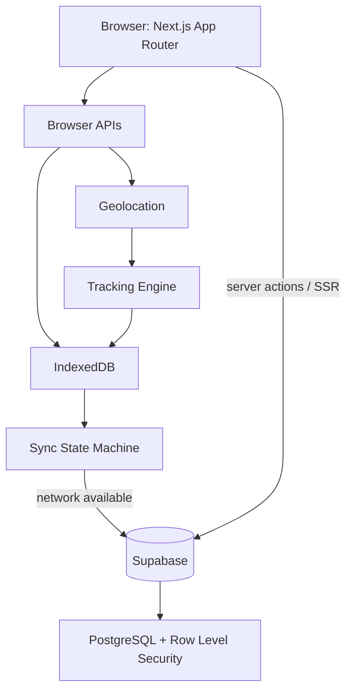
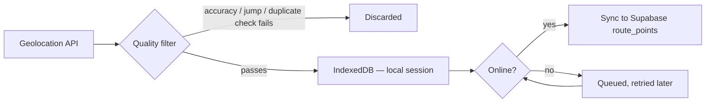
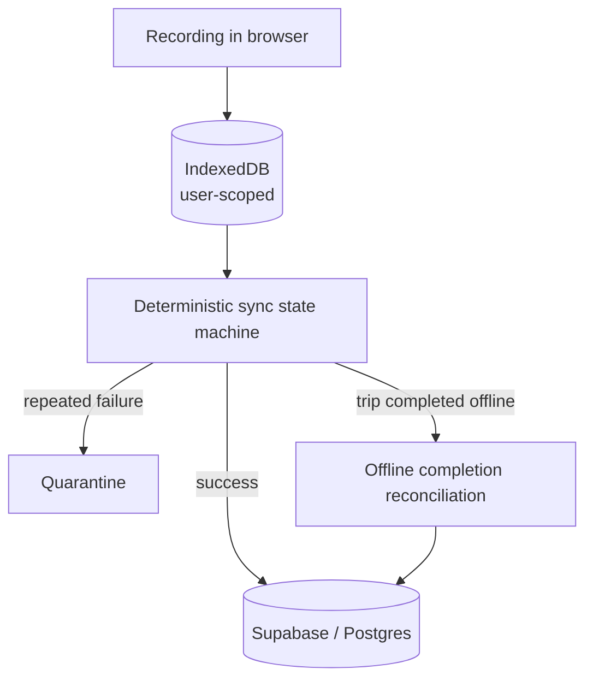
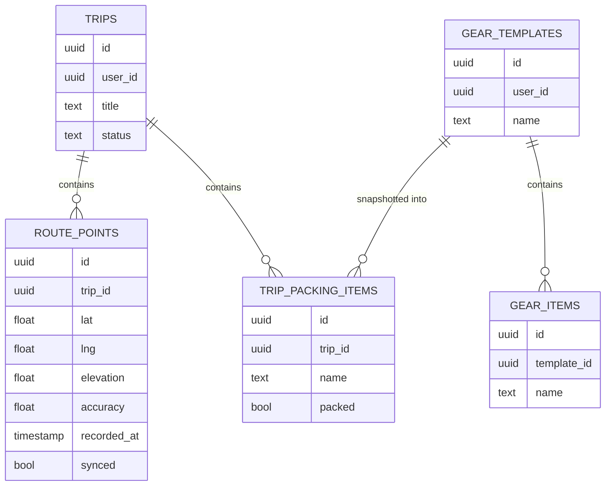

<div align="center">

# 🏔️ TrailMate

**Plan the route. Track the journey. Remember the trail.**

An outdoor trip planner and foreground GPS trail recorder built on Next.js, TypeScript, and Supabase — with route analytics computed only from points you actually recorded, never estimated or fabricated.

[**Live App**](https://trailmate-zeta.vercel.app/) · [**Repository**](https://github.com/Crusty-chirayu/Trailmate) · [**Report an Issue**](https://github.com/Crusty-chirayu/Trailmate/issues)


</div>

---

## The problem

A typical outdoor trip is stitched together from disconnected tools: a notes app for planning, a fitness app for GPS, a spreadsheet for gear, and a messaging thread for sharing the route with someone afterward. None of them agree with each other, and none of them are built around the trip as a single object.

## The solution

TrailMate keeps trip planning, GPS recording, route analytics, gear checklists, and trail sharing under one roof, backed by a single Postgres schema with row-level security instead of scattered client-side state. Every statistic shown — distance, elevation gain, duration — is derived from the actual `route_points` recorded during a session, not interpolated or backfilled.

---

## Features

### 🧭 Trip planning
Create, list, edit, and delete trips with full lifecycle handling — from a draft plan to a completed, analyzed expedition.

### 📍 GPS tracking
Foreground GPS recording using the browser Geolocation API, with quality filtering to reject inaccurate fixes, impossible jumps, and duplicate points before they're ever persisted.

### 💾 Offline-first storage
Route sessions are written to a user-scoped IndexedDB store first, so a dropped connection never interrupts recording. A deterministic sync state machine — with bounded retries, a drainable queue, and quarantine for points that repeatedly fail — reconciles local data with Supabase when connectivity returns, including sessions completed entirely offline.

### 📊 Route analytics
Distance, duration, speed, and elevation statistics, plus an elevation profile and chart, calculated server-side from the same canonical route-statistics logic used throughout the app.

### 📦 GPX & KML
Normalized import and export for both GPX and KML, so routes move cleanly between TrailMate and other mapping tools.

### 🔗 Trail sharing
Share a trip as a public trail page without exposing the rest of an account's data — enforced at the database layer, not just in the UI.

### 🗺️ Live & historical maps
Leaflet-based route rendering for both in-progress recording and completed trip history.

### 🎒 Gear & packing
Reusable gear templates with snapshot-based packing checklists per trip.

### 📶 Installable PWA
An installable offline app shell with an offline fallback page and screen wake lock support on browsers that expose the API.

### 🔐 Security by default
Every application table has row-level security enabled, scoped to the authenticated owner — enforced in Postgres, not just at the API boundary.

> **Not currently implemented:** background GPS recording after the page is closed, offline map tiles, offline mutation of trips/gear, and independently confirmed live production verification. See [Project status](#project-status) for the full picture.

---

## Architecture



| Layer | Responsibility |
|---|---|
| `src/app/` | App Router pages, server actions, and the auth callback route |
| `src/components/` | UI, tracking, packing, and analytics components |
| `src/lib/domain/` | Deterministic domain rules and server-side data services |
| `src/lib/tracking/` | Geolocation capture, IndexedDB persistence, and synchronization |
| `src/lib/supabase/` | Typed browser and server Supabase clients |
| `src/types/` | Database and domain contracts |
| `supabase/migrations/` | Authoritative schema history |
| `supabase/verification/` | Read-only hosted database checks |
| `scripts/security/` | Schema and tracked-secret validation |

Route statistics are calculated server-side from the same canonical logic everywhere they're shown, so a trip's numbers never drift depending on which screen you're looking at.

---

## GPS tracking, in detail

GPS recording runs in the foreground browser tab. When a position update arrives, it passes through a validation stage before it's ever written to storage:



- Recording is scoped per user in IndexedDB, and a session can resume after an interruption rather than losing progress.
- GPS is deliberately paused when the tab is backgrounded. The Screen Wake Lock API can keep the screen itself awake on supported browsers, but neither it nor the app can keep GPS running once the page is hidden or closed — there is no native background-tracking component.
- Points continue to be written locally while the network is unavailable and become eligible for sync once connectivity returns; the sync path includes bounded retry and quarantine handling rather than silent, unbounded retrying.
- Elevation statistics degrade gracefully — when altitude data isn't available from the device, TrailMate shows that explicitly rather than inventing a value.

---

## Offline-first architecture



Local persistence is the source of truth until a point is confirmed synced. This means:

- A network failure during a hike never blocks recording.
- A trip can be started, recorded, and completed entirely offline; reconciliation brings it in line with the server once the device is back online.
- Failed sync attempts are retried with bounded backoff rather than retried forever, and points that repeatedly fail are quarantined instead of silently dropped or silently blocking the whole queue.

**What this isn't:** offline map tiles. The public OpenStreetMap tile endpoint used for the map view isn't cached for offline use, so the map itself requires network access even though GPS data collection does not.

---

## Sharing & security

### Trail sharing
A trip can be published as a public trail page. Sharing is enforced at the database layer through Supabase's row-level security, not only hidden in the UI — a shared trip exposes only what sharing is meant to expose.

### Access model

All application tables have RLS enabled:

| Table | Ownership check |
|---|---|
| `trips` | `user_id` compared against `auth.uid()` |
| `gear_templates` | `user_id` compared against `auth.uid()` |
| `route_points` | Authorized through the owning trip |
| `gear_items` | Authorized through the owning template |
| `trip_packing_items` | Authorized through the owning trip |

Each table has explicit `SELECT` / `INSERT` / `UPDATE` / `DELETE` policies scoped to `authenticated`. Table privileges are revoked from `anon`, and the application never uses a service-role key.

### Application-level hardening

The Next.js configuration sets a Content Security Policy scoped to the origins the product actually needs (Supabase and OpenStreetMap tiles), `Referrer-Policy: strict-origin-when-cross-origin`, a restrictive `Permissions-Policy` (geolocation limited to self), `X-Content-Type-Options: nosniff`, frame denial via both CSP and `X-Frame-Options`, production HSTS, and removal of the `X-Powered-By` header. Protected routes are enforced centrally in `src/proxy.ts`, redirecting unauthenticated requests to `/login`.

> A Supabase anon/publishable key is meant for browser use and isn't treated as a secret on its own — but it's only safe because it's paired with correct RLS. It is never committed to tracked environment files, and neither is a service-role key or database password.

---

## Database



`supabase/migrations/` is the authoritative schema history, and `supabase/schema.sql` is a readable snapshot of the resulting schema — it's a reference snapshot, not an upgrade script, and must not be run against an existing database.

---

## Engineering quality

| Quality gate | Tooling |
|---|---|
| Unit / integration tests | Vitest |
| E2E | Playwright — auth-boundary, public-surface, and security-header specs |
| Accessibility | `@axe-core/playwright` checks on public and protected-entry surfaces |
| Type checking | TypeScript, strict mode |
| Linting | ESLint 9 (flat config) |
| Production build | `next build` |
| Database artifacts | Custom validator — migration versions, schema drift, RLS coverage, policy completeness, `anon` privilege revocation |
| Secret scanning | Custom scanner over tracked files, plus a check for env files in historical commits |
| Dependency audit | `npm audit` |

Continuous validation runs in GitHub Actions (`.github/workflows/ci.yml`) across four jobs: `quality` (lint, typecheck, build, unit tests), `e2e`, `database-artifacts`, and `security`.

---

## Testing

```bash
npm test              # Vitest unit/integration suite
npm run e2e            # Playwright E2E suite
npm run e2e:ui          # Playwright E2E, interactive UI mode
npm run typecheck      # tsc --noEmit
npm run lint            # ESLint
npm run build            # Production build
npm run db:validate      # Migration/RLS/schema validation
npm run security:scan    # Tracked-secret scan
npm run verify:live      # Live deployment health probe
```

`verify:live` checks that a deployed project is reachable, that the auth gateway correctly rejects bad credentials with no side effects, and that the PostgREST gateway accepts the configured key — printing only status codes, never credential values. The same probe runs in CI when the required secrets are configured, and reports an explicit skip otherwise.

---

## Local development

### Prerequisites

- Node.js `>=20.9.0`
- npm 10+
- A Supabase project (for auth and persistent data)

### Setup

```bash
git clone https://github.com/Crusty-chirayu/Trailmate.git
cd Trailmate
npm ci
cp .env.example .env.local
```

Set the two public, browser-safe values in `.env.local`:

```env
NEXT_PUBLIC_SUPABASE_URL=https://your-project-ref.supabase.co
NEXT_PUBLIC_SUPABASE_ANON_KEY=your-anon-or-publishable-key
```

`.env.local` and any environment file other than `.env.example` are gitignored. Never commit a service-role key, database password, or any other server secret.

### Database

With the Supabase CLI linked to your project:

```bash
supabase link --project-ref your-project-ref
supabase db push
```

Take a backup before migrating an existing database. After migrating, run `supabase/verification/phase12a_production_checks.sql` in the Supabase SQL editor and confirm RLS is enabled on all five application tables with `anon` holding no table privileges.

### Run it

```bash
npm run dev
```

---

## Deployment

The host needs exactly the two public environment variables shown above — never a service-role key, and never a server secret in a `NEXT_PUBLIC_*` variable. In the Supabase dashboard, the **Site URL** must match the deployed origin, and **Redirect URLs** must include `<origin>/auth/callback` (used by both signup confirmation and password recovery).

After deploying, `npm run verify:live` confirms the deployment end to end. Full account-level behavior — signup, login, logout, session refresh, recovery — is exercised by the Playwright E2E auth-boundary suite against the production build; the hosted SQL checks in `supabase/verification/` remain the authoritative proof of live database state and are run manually by a project operator.

---

## Project status

TrailMate has gone through several phases of hardening: Phase 11 completed route analytics, Phase 12A hardened the database, environment handling, and browser security configuration, Phase 12B hardened trip reliability, and Phase 12C added account-isolated offline storage, deterministic sync recovery, offline completion reconciliation, normalized GPX/KML import and export, trail sharing, and the installable PWA shell.

**Implemented:**
- Supabase email/password auth with cookie-backed sessions
- Full trip lifecycle (create, list, detail, edit, delete)
- Foreground GPS recording with quality filtering
- User-scoped IndexedDB storage with resumable recording
- Deterministic sync state machine with retry and quarantine
- Offline trip completion reconciliation
- RLS-protected sync of route points
- GPX/KML import and export
- Trip sharing and public trail pages
- Live and historical Leaflet maps
- Route distance, duration, speed, and elevation statistics with an elevation profile
- Gear templates and snapshot-based packing checklists
- Server-rendered analytics, activity summaries, trends, and records
- Installable PWA shell with offline fallback and screen wake lock
- E2E coverage for auth boundaries, public surfaces, and security headers
- GitHub Actions CI across quality, E2E, database, and security jobs

**Not yet implemented:**
- Background GPS recording after the page is closed
- Offline map tiles, or offline mutation of trips/gear
- Independently confirmed live production verification

The local verification baseline — lint, typecheck, unit tests, production build, Playwright E2E, database artifact validation, secret scanning, dependency audit, and accessibility checks — passes locally. A hosted deployment with real Supabase credentials is still required to close the loop on live account-flow verification.

---

## 🔭 Future directions

These are ideas, not commitments:

- Offline map tile caching for genuinely map-available offline use
- Richer route planning tools (waypoints, multi-day segmenting)
- Weather overlay for planned routes
- A native mobile companion for background tracking
- Additional outdoor activity types beyond hiking
- Community-facing trail discovery

---

## Accessibility

Public and protected-entry surfaces are checked with `@axe-core/playwright` as part of the local verification baseline, alongside the Playwright E2E suite for auth-boundary and public-surface behavior.

---

## Contributing

1. Fork the repository
2. Clone your fork and `npm ci`
3. Create a branch for your change
4. Copy `.env.example` to `.env.local` and point it at your own Supabase project
5. Make your change
6. Run the full local gate: `npm run lint && npm run typecheck && npm test && npm run build`
7. Open a pull request

CI will additionally run the E2E, database-artifact, and security-scan jobs.

---

## Security

- Never commit `.env.local`, a service-role key, or a database password.
- Row-level security is part of the application's security boundary, not an afterthought — it's the actual enforcement mechanism for who can read or write what.
- If you find a vulnerability, please open a private report rather than a public issue.

---

## License

MIT — see [`LICENSE`](https://github.com/Crusty-chirayu/Trailmate/blob/main/LICENSE).

---

## Author

**Chirayu Babu Jaysawal**
[GitHub @Crusty-chirayu](https://github.com/Crusty-chirayu)
